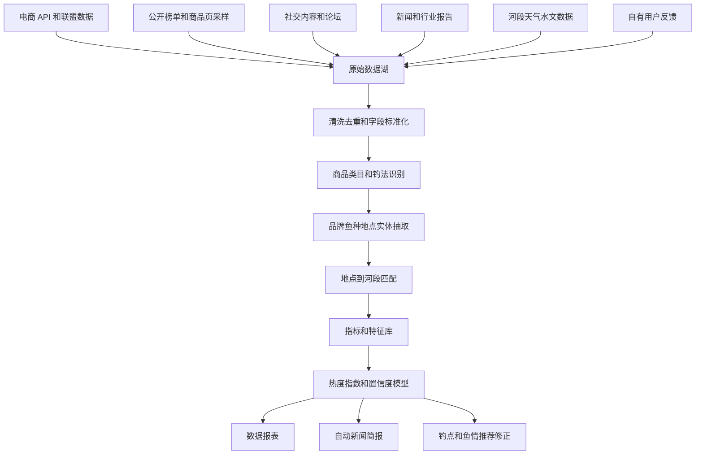

# 钓鱼人分布、商品数据与趋势分析落地方案

## 1. 目标结论

本方案目标不是用单一爬虫精确统计全国钓鱼人数量，而是建立一套“多源数据交叉验证”的钓鱼人分析系统，用商品、内容、新闻、赛事、地理和自有反馈数据共同估算：

1. 钓鱼人数量规模。
2. 钓鱼人类型。
3. 钓法和鱼种偏好。
4. 地区分布。
5. 消费能力和装备趋势。
6. 季节、天气、水位变化下的活跃趋势。

核心判断：

- 商品数据负责识别“钓鱼人买什么”。
- 内容数据负责识别“钓鱼人玩什么”。
- 新闻和行业报告负责建立“全国和区域基线”。
- 地理、水文和自有反馈负责判断“钓鱼人在哪里活跃，以及鱼情是否真实”。
- 多源交叉后输出的是“热度指数、趋势指数、置信度”，而不是未经校准的绝对人数。

## 2. 数据源落地方向

### 2.1 电商官方数据和联盟 API

优先级最高，适合作为商品基础库和全类目覆盖底座。

可接入来源：

1. 淘宝联盟。
2. 京东联盟。
3. 1688 开放平台。
4. 抖音精选联盟。
5. 快手联盟。
6. 拼多多开放能力或授权渠道。

可获取字段：

- 商品 ID。
- 商品标题。
- 平台类目。
- 品牌。
- 店铺。
- 商品价格。
- SKU。
- 销量或销量区间。
- 评论数。
- 好评率。
- 榜单排名。
- 佣金比例。
- 店铺所在地或发货地。
- 商品图片。
- 商品详情描述。

落地用途：

- 建立钓具商品基础库。
- 分析价格带和消费层级。
- 分析不同平台的爆品和类目结构。
- 判断路亚、台钓、溪流钓、海钓等钓法相关装备的消费趋势。
- 识别品牌格局和产业带，例如威海鱼竿、临湘浮漂、湖北/川渝饵料、浙江和广东装备产业带。

注意事项：

- 优先走 API、联盟或授权数据，不建议依赖强反爬。
- 不同平台销量口径不同，不能直接横向相加。
- 销量、GMV、榜单、评论数都需要转成统一热度指数。

### 2.2 第三方电商数据平台

适合用于趋势校准和 GMV 估算，不一定全量接入，但能提高准确度。

可选来源：

1. 蝉妈妈。
2. 飞瓜数据。
3. 灰豚数据。
4. 新榜。
5. 有米云。
6. 魔镜市场情报。
7. 生意参谋、京东商智等商家侧数据。

可获取内容：

- 抖音、快手、小红书等内容电商热度。
- 达人带货数据。
- 直播场次。
- 商品 GMV 估算。
- 爆品榜单。
- 品牌榜单。
- 类目增长率。
- 用户画像标签。

落地用途：

- 校准平台 API 中缺失或不稳定的销量数据。
- 判断某类商品增长是否真实，例如溪流钓、路亚饵、探鱼器、打窝船。
- 分析达人、赛事、直播对商品趋势的影响。
- 识别新兴类目和爆款商品。

准确度策略：

- 第三方数据只作为校准和趋势参考，不作为唯一事实来源。
- 同一个类目至少与电商商品库、内容热度、报告数据交叉验证。

### 2.3 公开商品页和榜单采样

适合补盲，不适合作为绝对销量依据。

可采集对象：

1. 平台搜索结果页。
2. 商品榜单页。
3. 店铺公开商品页。
4. 商品评论区公开内容。
5. 商品详情页。

采集字段：

- 标题关键词。
- 价格。
- 月销展示值。
- 评论数。
- 问答内容。
- SKU 规格。
- 商品图片。
- 店铺等级。
- 发货地。
- 榜单位置。

落地用途：

- 发现平台 API 没覆盖的新词、新品牌、新类目。
- 从评论里识别使用场景，例如野钓、黑坑、路亚翘嘴、海钓鲈鱼、冬钓鲫鱼。
- 补充长尾商品。
- 建立商品标题到标准类目的训练样本。

合规要求：

- 低频采样，遵守 robots、平台协议和访问限制。
- 不绕过登录、验证码、风控和付费墙。
- 不采集个人敏感信息。
- 只保存分析所需字段，避免保存无关用户内容。

### 2.4 社交内容平台

用于识别钓法趋势、人群变化、地点热度和鱼种偏好。

可分析平台：

1. 抖音。
2. 快手。
3. 小红书。
4. B 站。
5. 微博。
6. 钓鱼之家。
7. 百度贴吧。
8. 垂钓论坛和地方钓友社区。

可采集字段：

- 标题。
- 正文。
- 标签。
- 发布时间。
- 作者公开地区。
- 内容定位。
- 互动量。
- 评论内容。
- 图片和视频封面。
- 商品挂载信息。
- 鱼获图片。

落地用途：

- 分析钓法热度：台钓、路亚、溪流钓、海钓、小物钓、黑坑、夜钓。
- 分析鱼种热度：鲫鱼、鲤鱼、草鱼、青鱼、翘嘴、黑鱼、鲈鱼、鳜鱼。
- 分析地区热度：省、市、区县、河流、水库、湖泊。
- 分析人群趋势：年轻化、女性用户、城市周边轻量化、亲子钓鱼、装备党。
- 识别风险事件：禁钓、放生争议、电鱼网鱼、水位异常、洪水、污染、危险钓点。

注意事项：

- 内容平台的地点经常不准确，需要地名识别和河段匹配。
- 热门内容会受到算法推荐影响，需要用多平台数据平滑。
- 商业推广内容需要识别并降权。

### 2.5 新闻、行业报告和协会数据

用于建立全国大盘和长期趋势。

可用来源：

1. 中国钓鱼协会和地方协会公开信息。
2. 钓具行业报告。
3. 户外运动报告。
4. 电商平台垂钓消费趋势报告。
5. 新华网、央广网、界面新闻、36 氪等行业新闻。
6. 地方文旅、体育、农业农村、水利部门公开新闻。
7. 赛事报名、赛事直播、赛事结果公告。

可提取指标：

- 全国钓鱼人规模。
- 活跃钓鱼人规模。
- 注册会员规模。
- 年龄结构。
- 性别结构。
- 省份消费排名。
- 市场规模。
- 类目增长率。
- 赛事数量。
- 文旅项目数量。
- 产业带分布。

落地用途：

- 给数据报表提供可信基线。
- 对平台数据进行规模校准。
- 给新闻简报提供引用依据。
- 判断宏观趋势，例如年轻化、轻量化、专业化、国产高端化。

### 2.6 地图、河段、水文和天气数据

用于把钓鱼人活跃度映射到真实水域。

可接入来源：

1. 天地图和 1:25 万基础地理数据。
2. 河流、水库、湖泊矢量数据。
3. 水文站水位和流量数据。
4. 天气数据。
5. 潮汐数据。
6. 禁钓区、保护区、饮用水源保护区数据。
7. 自建河段库和钓鱼适宜性评分数据。

落地用途：

- 把内容中的“某河、某水库、某湖”匹配到标准河段。
- 分析某河段的钓鱼活跃度。
- 将商品和内容趋势与水文天气关联。
- 判断热度上升是否可能来自真实鱼情变化。
- 输出区域钓鱼人分布地图。

### 2.7 自有用户反馈数据

用于最终校准真实鱼情和本地需求。

MVP 建议采集：

1. 今日有口/空军。
2. 鱼获数量。
3. 鱼种。
4. 钓法。
5. 使用装备。
6. 河段位置。
7. 禁钓、危险、污染、水位异常反馈。
8. 图片证据。

落地用途：

- 修正公开内容热度。
- 校准商品趋势和真实使用场景。
- 识别本地高活跃河段。
- 训练区域化钓法和鱼种推荐模型。
- 反向验证钓点适宜性评分。

隐私要求：

- 对外只展示河段级热度，不默认展示精确钓点。
- 用户位置和图片需要明确授权。
- 支持用户删除鱼获图片和位置记录。
- 热门小钓点需要做模糊化，避免过度曝光和生态压力。

## 3. 标准商品类目体系

平台类目不统一，必须建立自有标准类目。建议使用“一级类目 + 二级类目 + 钓法标签 + 鱼种标签 + 场景标签”的结构。

### 3.1 一级类目

1. 钓竿。
2. 渔轮。
3. 鱼线。
4. 鱼钩和线组。
5. 浮漂和铅坠。
6. 饵料。
7. 路亚饵。
8. 钓箱、钓椅和钓台。
9. 鱼护、抄网和鱼桶。
10. 竿包、装备包和收纳。
11. 电子设备。
12. 夜钓设备。
13. 船艇和涉水装备。
14. 服饰和防护。
15. 工具配件。
16. 钓场、赛事、培训和导钓服务。

### 3.2 二级类目示例

钓竿：

- 台钓竿。
- 溪流竿。
- 路亚竿。
- 海竿。
- 矶竿。
- 筏竿。
- 飞钓竿。
- 冰钓竿。

渔轮：

- 纺车轮。
- 水滴轮。
- 鼓轮。
- 筏钓轮。
- 前打轮。

鱼线：

- 尼龙线。
- PE 线。
- 碳线。
- 主线。
- 子线。
- 前导线。

鱼钩和线组：

- 袖钩。
- 伊势尼。
- 新关东。
- 伊豆。
- 串钩。
- 爆炸钩。
- 铅头钩。
- 曲柄钩。
- 成品线组。

浮漂和铅坠：

- 立漂。
- 七星漂。
- 夜光漂。
- 电子漂。
- 铅皮。
- 铅坠。
- 路亚铅坠。

饵料：

- 鲫鱼饵。
- 鲤鱼饵。
- 草鱼饵。
- 青鱼饵。
- 鲢鳙饵。
- 窝料。
- 颗粒。
- 酒米。
- 虾粉。
- 添加剂。

路亚饵：

- 米诺。
- 亮片。
- 铅笔。
- 波趴。
- VIB。
- 软虫。
- 雷蛙。
- 铁板。
- 旋转亮片。
- 复合亮片。

电子设备：

- 探鱼器。
- 打窝船。
- 夜钓灯。
- 电子漂。
- 户外电源。
- 运动相机。
- 钓鱼摄像头。

服饰和防护：

- 钓鱼服。
- 防晒衣。
- 防晒帽。
- 偏光镜。
- 手套。
- 雨衣。
- 防滑鞋。
- 涉水裤。
- 救生衣。

服务类：

- 钓场门票。
- 黑坑票。
- 赛事报名。
- 钓鱼培训。
- 导钓服务。
- 船钓服务。

### 3.3 钓法标签

1. 台钓。
2. 传统钓。
3. 路亚。
4. 海钓。
5. 矶钓。
6. 筏钓。
7. 溪流钓。
8. 小物钓。
9. 黑坑。
10. 竞技钓。
11. 夜钓。
12. 冰钓。
13. 飞钓。
14. 船钓。

### 3.4 鱼种标签

淡水常见鱼种：

- 鲫鱼。
- 鲤鱼。
- 草鱼。
- 青鱼。
- 鲢鳙。
- 翘嘴。
- 黑鱼。
- 鳜鱼。
- 鲈鱼。
- 黄颡鱼。
- 罗非鱼。
- 鳊鱼。

海水常见鱼种：

- 海鲈。
- 黑鲷。
- 黄鱼。
- 石斑。
- 马鲛。
- 带鱼。
- 鲷类。

### 3.5 场景标签

1. 野钓。
2. 黑坑。
3. 水库。
4. 江河。
5. 湖泊。
6. 溪流。
7. 城市周边。
8. 海边。
9. 船钓。
10. 夜钓。
11. 亲子。
12. 露营钓鱼。
13. 轻量化。
14. 专业竞技。

## 4. 数据处理流程

处理步骤：

1. 采集原始数据，保留来源、时间、平台、原始字段和采集批次。
2. 清洗标题、价格、销量、评论、地区、品牌等字段。
3. 商品去重，同款商品按平台、店铺、规格聚合。
4. 商品标准类目归一。
5. 识别钓法、鱼种、场景和用户层级。
6. 从内容和评论中抽取地点、河流、水库、湖泊名称。
7. 将地点匹配到标准河段库。
8. 生成商品热度、内容热度、区域热度、鱼种热度、钓法趋势。
9. 多源交叉验证，计算置信度。
10. 输出报表、地图、新闻简报和推荐模型修正项。

## 5. 核心分析指标

### 5.1 商品类目指标

- 类目商品数。
- 类目销量指数。
- 类目 GMV 指数。
- 类目价格中位数。
- 类目价格带分布。
- 类目评论数。
- 类目品牌集中度。
- 类目爆品集中度。
- 类目 7 天、30 天、90 天增长率。

### 5.2 钓法趋势指标

- 台钓热度指数。
- 路亚热度指数。
- 溪流钓热度指数。
- 海钓热度指数。
- 黑坑热度指数。
- 小物钓热度指数。
- 夜钓热度指数。
- 各钓法同比、环比变化。

### 5.3 鱼种偏好指标

- 鱼种商品关联热度。
- 鱼种内容热度。
- 鱼种鱼获反馈热度。
- 鱼种季节变化。
- 鱼种区域分布。

### 5.4 用户层级指标

按照商品组合和价格带推断用户类型：

1. 新手入门用户：低价套装、便携装备、基础饵料。
2. 休闲野钓用户：手竿、鲫鱼鲤鱼饵、钓椅、鱼护。
3. 路亚用户：路亚竿、纺车轮、水滴轮、米诺、亮片、软虫。
4. 黑坑用户：黑坑饵料、竞技线组、钓箱、浮漂、炮台。
5. 海钓用户：海竿、矶竿、船钓轮、铁板、救生衣。
6. 高阶装备用户：探鱼器、打窝船、高端竿轮、钓台。
7. 轻量化用户：溪流竿、小物钩、便携鱼护、小包装备。

### 5.5 地区分布指标

- 省份钓鱼商品消费热度。
- 城市内容发布热度。
- 河段鱼获反馈热度。
- 钓场和赛事密度。
- 产业带供给热度。
- 本地钓法偏好。
- 本地鱼种偏好。

### 5.6 风险和合规指标

- 禁钓新闻数量。
- 禁钓反馈数量。
- 危险河段反馈数量。
- 水位异常关联热度。
- 保护区和饮用水源地命中数。
- 高热度小钓点曝光风险。

## 6. 准确度和全面性保障

### 6.1 多源交叉验证

单一数据源只能作为信号，不能直接作为结论。

高置信结论：

- 至少 3 类来源同向，例如电商销量、内容热度、自有反馈同时上升。

中置信结论：

- 至少 2 类来源同向，例如商品热度和内容热度同时上升。

低置信结论：

- 只有单一来源，或者样本量不足。

示例：

- “溪流钓增长”如果同时出现在抖音电商成交、商品搜索量、小红书内容和论坛讨论中，可以标为高置信。
- “某地路亚活跃”如果只有短视频热度，没有商品和鱼获反馈支撑，只能标为低到中置信。

### 6.2 统一指数体系

不同平台数据口径不一致，需要统一成指数。

建议输出：

- 商品热度指数。
- 内容热度指数。
- 区域活跃指数。
- 鱼种热度指数。
- 钓法趋势指数。
- 消费能力指数。
- 置信度分。

不要直接输出：

- 未校准的全国钓鱼人绝对人数。
- 不同平台销量直接相加。
- 未注明来源和置信度的 GMV。

### 6.3 去重和反作弊

商品去重：

- 标题相似度。
- 图片相似度。
- 品牌 + 型号 + 规格。
- 店铺和 SKU。

内容去重：

- 文本相似度。
- 图片指纹。
- 发布时间。
- 作者。
- 地点。

异常降权：

- 明显营销内容。
- 重复铺货。
- 异常低价。
- 标题堆词。
- 评论刷量。
- 同一用户短期大量反馈。
- 与河段距离过远的鱼获反馈。

### 6.4 类目覆盖检查

每周生成类目覆盖报告：

- 一级类目是否都有数据。
- 二级类目是否缺失。
- 各平台覆盖率。
- 长尾类目样本量。
- 新增关键词。
- 无法归类商品数量。
- 类目识别置信度。

覆盖目标：

- MVP 阶段覆盖 80% 核心交易类目。
- 内测阶段覆盖 90% 常见钓具类目。
- 商业化阶段覆盖商品、服务、赛事、导钓和钓场全类目。

## 7. 报表和产品输出

### 7.1 管理后台报表

1. 全国钓鱼人趋势总览。
2. 省市钓鱼活跃度地图。
3. 商品类目热度榜。
4. 钓法趋势榜。
5. 鱼种热度榜。
6. 品牌榜。
7. 价格带分布。
8. 平台对比。
9. 产业带分析。
10. 风险和禁钓事件看板。

### 7.2 地图产品输出

1. 河段热度图。
2. 鱼种分布图。
3. 钓法分布图。
4. 鱼获反馈热力图。
5. 禁钓和危险提示图。
6. 天气、水位、鱼情关联图。

对外展示建议：

- 默认展示河段级热度。
- 不展示精确个人钓点。
- 小水域高热度时做模糊化。
- 禁钓和保护区优先提示。

### 7.3 自动新闻简报

每周或每日自动生成：

1. 本周钓鱼热度变化。
2. 热门省份和城市。
3. 增长最快钓法。
4. 热门鱼种。
5. 商品爆品和价格变化。
6. 赛事和文旅新闻。
7. 禁钓、天气、水位风险。

示例标题：

- 本周华南路亚内容热度上升，翘嘴和鲈鱼相关商品同步增长。
- 溪流钓轻量化装备持续走热，城市周边短途垂钓需求增强。
- 江苏、广东、浙江垂钓消费热度领先，饵料和路亚饵增长明显。

## 8. 技术选型

### 8.1 数据采集

推荐技术：

- Python。
- Scrapy。
- Playwright。
- Requests / HTTPX。
- Airflow 或 Dagster。
- Kafka 或 Redpanda。
- Apify、Firecrawl 等第三方采集服务可作为补充。

选型建议：

- API 和联盟数据用定时任务拉取。
- 公开页面采样用 Scrapy。
- 需要渲染的页面用 Playwright。
- 数据量较小时先用 Airflow 定时任务。
- 数据量扩大后引入 Kafka 或 Redpanda 做消息队列。

### 8.2 数据存储

推荐技术：

- PostgreSQL。
- PostGIS。
- ClickHouse。
- MinIO 或 S3。
- Redis。

用途划分：

- PostgreSQL 存业务主表、商品标准类目、品牌、规则配置。
- PostGIS 存河段、水域、城市、省份、空间索引。
- ClickHouse 存行为日志、采集明细、时报表、趋势指标。
- MinIO/S3 存图片、原始 HTML、原始 JSON、报告文件。
- Redis 做热点榜单、任务锁、短期缓存。

### 8.3 数据清洗和建模

推荐技术：

- Python Pandas。
- Polars。
- DuckDB。
- dbt。
- scikit-learn。
- LightGBM。
- sentence-transformers。
- 中文分词和实体识别模型。
- 大模型 API 或本地大模型。

处理任务：

- 商品标题分类。
- 品牌识别。
- 钓法识别。
- 鱼种识别。
- 场景识别。
- 地名抽取。
- 商品去重。
- 情绪和风险识别。
- 内容营销降权。
- 热度指数计算。

模型建议：

- 规则词典先行，覆盖高频类目。
- 机器学习处理模糊标题和长尾商品。
- 大模型用于低频复杂内容抽取和新闻摘要。
- 关键结论用规则和统计校验，不完全依赖大模型。

### 8.4 地理和空间分析

推荐技术：

- PostGIS。
- GeoPandas。
- Shapely。
- GDAL。
- Tippecanoe。
- Martin 或 Tegola。
- MapLibre GL JS。

用途：

- 河段标准化。
- 地名到河段匹配。
- 点位和河段距离计算。
- 热力网格生成。
- 矢量瓦片发布。
- 地图前端展示。

### 8.5 API 服务

推荐技术：

- FastAPI。
- Pydantic。
- SQLAlchemy。
- Celery 或 Dramatiq。
- OpenAPI。

主要接口：

- 商品类目趋势接口。
- 钓法趋势接口。
- 鱼种趋势接口。
- 区域热度接口。
- 河段热度接口。
- 新闻简报接口。
- 置信度解释接口。
- 后台审核接口。

### 8.6 前端和报表

推荐技术：

- Next.js。
- React。
- TypeScript。
- ECharts。
- Apache Superset 或 Metabase。
- MapLibre GL JS。

产品形态：

- 管理后台用 Next.js + ECharts + MapLibre。
- 内部 BI 可以先用 Metabase 或 Superset。
- 地图展示用 MapLibre。
- 趋势图、榜单、价格带分布用 ECharts。

### 8.7 部署和运维

MVP 选型：

- Docker Compose。
- PostgreSQL + PostGIS。
- ClickHouse。
- MinIO。
- Redis。
- FastAPI。
- Next.js。

生产增强：

- Kubernetes。
- Airflow。
- Kafka 或 Redpanda。
- Prometheus。
- Grafana。
- Loki。
- Sentry。

监控指标：

- 每日采集成功率。
- 每个平台失败率。
- 数据延迟。
- 类目识别准确率。
- 无法归类商品占比。
- 地点匹配成功率。
- 报表生成耗时。
- 异常数据比例。

## 9. MVP 落地计划

### 第 1 阶段：商品和内容数据样板

周期：2-4 周。

范围：

- 选择 1-2 个电商来源。
- 选择 2 个内容来源。
- 覆盖 10 个核心一级类目。
- 覆盖 20-40 个高频二级类目。
- 建立商品标准类目和关键词词典。

核心输出：

- 商品基础库。
- 类目热度榜。
- 价格带分布。
- 钓法趋势榜。
- 鱼种词频榜。
- 数据源质量报告。

### 第 2 阶段：区域和河段映射

周期：4-8 周。

范围：

- 接入河段库。
- 接入天气、水位、潮汐数据。
- 做地点实体抽取。
- 将内容地点匹配到省、市、河段。
- 引入自有鱼获和空军反馈。

核心输出：

- 省市钓鱼活跃度地图。
- 河段热度指数。
- 鱼种区域分布。
- 钓法区域分布。
- 数据置信度分。

### 第 3 阶段：趋势模型和自动简报

周期：8-12 周。

范围：

- 建立多源热度指数。
- 建立趋势异常检测。
- 建立自动新闻摘要。
- 建立风险事件识别。
- 建立类目覆盖率监控。

核心输出：

- 周报自动生成。
- 钓法趋势预测。
- 商品类目增长预警。
- 禁钓和风险事件看板。
- 钓点推荐修正项。

## 10. 推荐 MVP 技术组合

如果要快速落地，推荐第一版使用：

- 采集：Python + Scrapy + Playwright。
- 调度：Airflow。
- 业务库：PostgreSQL + PostGIS。
- 分析库：ClickHouse。
- 文件存储：MinIO。
- 后端：FastAPI。
- 前端：Next.js + ECharts + MapLibre。
- BI：Metabase。
- 任务队列：Redis + Celery。
- 文本识别：规则词典 + sentence-transformers + 大模型抽取。

第一版不建议直接上复杂湖仓和大规模实时流处理。先把数据源、类目体系、置信度和报表闭环跑通，再扩展到 Kafka、Kubernetes 和更复杂的模型训练。

## 11. 风险和边界

1. 不能承诺通过公开爬虫获得全国钓鱼人精确人数。
2. 不能把不同平台销量直接相加。
3. 商品购买地、发货地和实际钓鱼地不是同一个概念。
4. 内容热度受平台算法影响，必须跨平台校准。
5. 评论和鱼获内容存在营销、摆拍和重复发布。
6. 公开钓点过度曝光可能带来生态压力。
7. 地图和坐标展示需要遵守地图合规要求。
8. 用户位置、图片和轨迹必须明确授权。

## 12. 最终产品定位

本系统最终应定位为：

> 基于电商商品、内容平台、新闻报告、赛事文旅、河段水文和用户反馈的钓鱼人分布与趋势分析系统。它不依赖单一数据源，而是通过多源交叉验证，输出钓鱼人活跃度、钓法趋势、鱼种偏好、商品消费、区域分布和风险事件，为钓点推荐、钓具选品、文旅选址、赛事运营和鱼情分析提供数据支撑。
